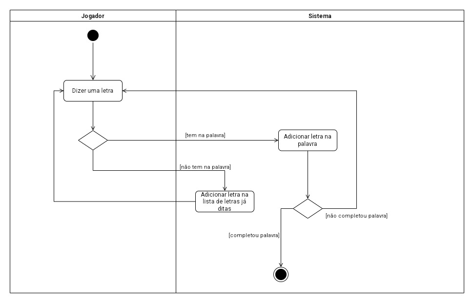

# Forca do Fortnite 
# Feito por: Leonardo Macêdo e Miguel Oliveira 
# Descrição 
Esse é um projeto de Jogo da Forca com o tema do jogo Fortnite! 
 

# Desenvolvimento
# HTML 
No HTML utilizamos elementos SVG para desenhar a forca graficamente, indicando as partes do corpo à medida que o jogador erra letras. A página exibe a palavra secreta a ser adivinhada, uma dica relacionada ao Fortnite e mantém um registro de letras já tentadas. Além disso, adicionamos um mecanismo de popup que aparece quando o jogo termina, exibindo uma mensagem específica e oferecendo a opção de jogar novamente. E um link para o arquivo de script JavaScript para adicionar interatividade ao jogo, como a função `reiniciarJogo()`, chamada ao clicar no botão "Jogar novamente" e entre outras que vamos explicar.  
 

# CSS 
O CSS estiliza a página HTML do jogo. O estilo global é definido para o corpo (`body`), utilizamos o flexbox para organizar os elementos em coluna centralizada, cobrindo toda a largura e altura da viewport. A imagem de fundo é uma mistura entre uma gradiente branca translúcida e uma imagem do Fortnite. As cores padrão do texto definimos como preto, e a fonte utilizada é Arial. O container principal do jogo (`jogo-container`) usa flexbox para distribuir seus elementos uniformemente. O desenho da forca (`forca`) é estilizado com propriedades para cor, largura de traço e posição. Elementos específicos, como partes da forca (`forca-parte`), letras erradas (`letras-erradas-container`), e a palavra secreta (`palavra-secreta-container`) têm estilos específicos de fonte e espaçamento. Um aviso para letras repetidas (`aviso-palavra-repetida`) é posicionado na parte inferior, com uma animação suave de transição quando aparece. O popup que aparece ao final do jogo (`popup-container`) é estilizado com cores de fundo, sombras e espaçamento interno. O botão no popup (`popup button`) tem estilos para cursor, cor de fundo, borda e tamanho de fonte.  
 

# JavaScript 
É criado um array chamado tecnologias que contém palavras relacionadas ao Fortnite. Uma palavra secreta é escolhida aleatoriamente do array de tecnologias. Arrays para armazenar letras erradas e corretas são inicializados. Um evento é adicionado para capturar pressionamentos de tecla. O código verifica se a tecla pressionada é uma letra. Se a tecla pressionada for uma letra, ela é verificada para saber se está na palavra secreta. A função atualizarJogo() é chamada para atualizar a exibição.
  

Atualiza o conteúdo HTML para mostrar as letras erradas já tentadas. Atualiza o conteúdo HTML para mostrar as letras corretas adivinhadas na palavra secreta. 
  

Verifica se o jogador ganhou ou perdeu e exibe uma mensagem correspondente, mostrando um popup ao final do jogo. Exibe visualmente as partes da forca correspondentes às letras erradas.
  

Mostra um aviso visual quando uma letra já tentada é repetida. Verifica se o código de tecla corresponde a uma letra no intervalo A-Z. Recarrega a página para reiniciar o jogo quando o botão "Jogar novamente" é clicado no popup.
 
# Diagramas
# Diagrama de Classes
 

# Documentação 
 

# Diagrama de Casos de Uso 
 

# Diagrama de Atividades 
 
